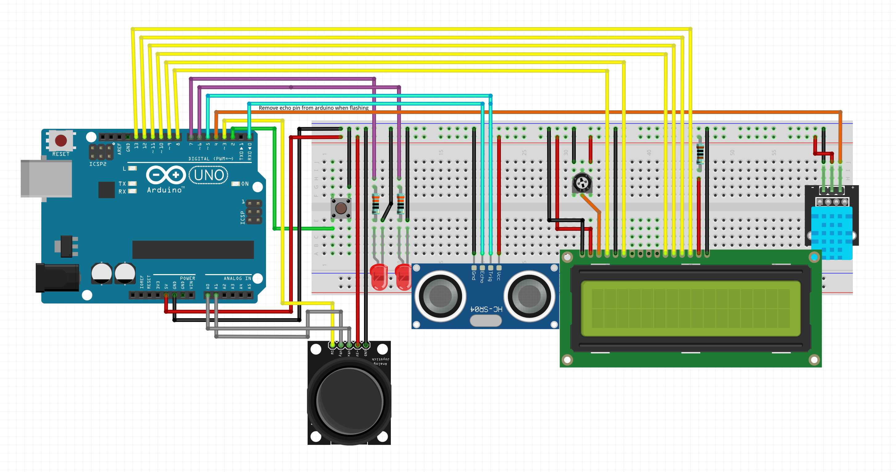

# Funcionamiento

Para obtener el funcionamiento deseado en la práctica he utilizado tanto threads, como interrupciones y el watchdog.

Este último ha sido utilizado para que en el caso de que el funcionamiento se quede bloqueado en alguno de los threads, se reinicie el sistema y vuelva a
funcionar correctamente. 
El watchdog esta puesto para que la placa se reinicie si esta bloqueda más de 2 segundos:

```cpp
  wdt_disable();
  wdt_enable(WDTO_2S);
```

Para obtener un correcto funcionamiento de este, primero lo deshabilito para rehabilitarlo con el correcto tiempo. Luego, para que no se reinicie periodicamente, en el loop principal
lo reinicio.

```cpp
void loop() {
  controller.run();
  wdt_reset();
}
```

En cuanto a los threads, como se puede ver en el loop principal, uso un controlador para manejar todos los threads de forma más sencilla, y se decide cual de los threads a ejecutar
habilitando y deshabilitando los mismos en el controlador. Utilizo un thread por cada sensor, excepto para los botones que usan interrupciones, y uno extra para el 'timer'. Estos threads están definidos cada uno en una clase que hereda de la clase Thread en un ficher .h y en otro .cpp para luego usarlos en el programa principal como una librería.

Breve resumen de sus funciones:

- Blink_Led: incorpora el funcionamiento para hacer el led parpade y que se encienda y apague.
- Fade_Led: incorpora el funcionamiento para hacer el led se ilumine de forma incremental y que se encienda y apague.
- Counter: simplemente imprime el tiempo que ha pasado desde el incio, millis().
- Joystick: incorpora el manejo del joystick, no el switch del mismo, para controlar la nevagación.
- Thermometer: imprime la temperatura y la humedad en el lcd.
- Ultrasonic: incorpora el funcionamiento del ultrasonido y ejecuta un callback cuando la distancia es menor que la referencia y viceversa.
- Timer: ejecuta un callback cuando pasa el tiempo estipulado.

El funcionamiento del programa se basa principalmente en estos callbacks cuya función es activar y desactivar los threads en el controlador, así
es como se controla el flujo del programa en vez de con una maquina de estados, y esto ayuda a que el loop sea de la forma más sencilla posible y que el watchdog sea reiniciado
de forma sencilla y visible.

Otra parte importante es el thread del timer que ayuda a solucionar de forma sencilla las partes donde por ejemplo se debe mostrar el termómetro durante 5 segundos:

```cpp
controller.add(&thermoThread);
timer.wait(5000, allow_selection); // Wait for 5000 milliseconds or 5 seconds and then execute the callback 

void allow_selection() {
  controller.remove(&thermoThread);
  controller.add(&joystickThread);
}
```

Además, también he utilizado 2 interrupciones para cada uno de los 2 botones, el boton normal y el switch del joystick. En la primera interrupción es el único sitio donde se encuentra alguna
semejanza con una máquina de estados, ya que para reiniciar el modo de servicio se necesita saber si el estado actual es el de servicio.

Por último, debo mencionar el uso de una clase extra: el menu. El uso de esta clase simplifica tanto la navegación en servicio y en administrador como la selección de que thread debe ejecutar. El menú está compuesto por dos listas que contienen las bebidas y el menu de administrador respectivamente. Y al igual que anteriormente, aquí también aparecen los callbacks para simplificar su funcionamiento, permitiendo la entrada y salida personalizadas de cada submenu sin utilizar una máquina de estados.

## Esquema del sistema



## Video del funcionamiento

<video src="../images/video.mp4" controls title="Demonstración"></video>
