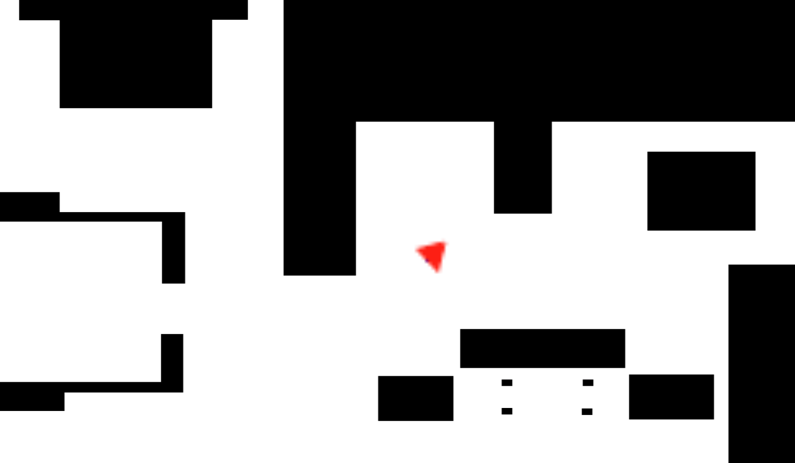
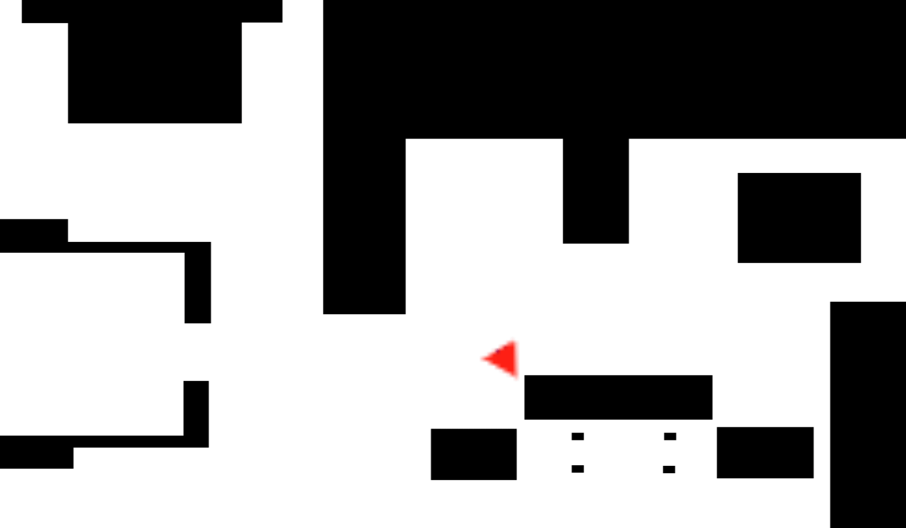
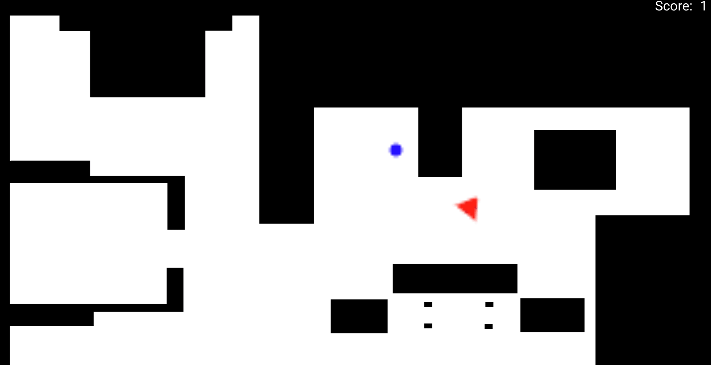
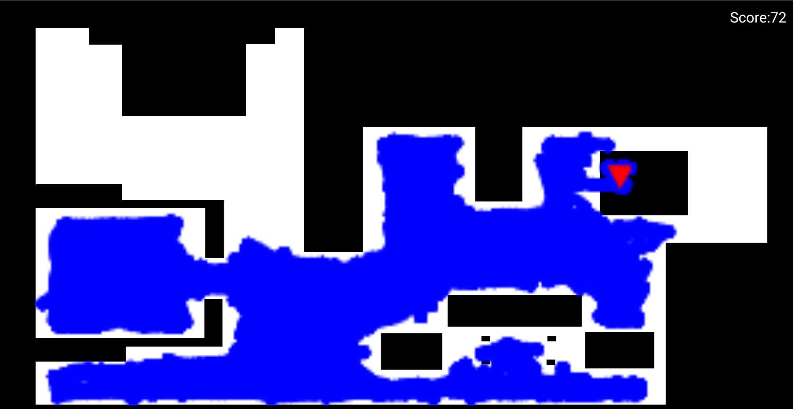

# Firsts attempts

Because this was my first time writting code to controle a robot using this API, I decided to start with a very simple approach:

- It goes forward until it detects an object less than 1 meter in front.
- Then it stops printing STOP to the terminal and it ends.



```python
from GUI import GUI
from HAL import HAL

# Enter sequential code!

while True:
    # Enter iterative code!

    print(HAL.getLaserData().values[90])
    if HAL.getLaserData().values[90] > 1 :
        HAL.setV(3)
    else :
      print("STOP")
      HAL.setV(0)
      exit(10)
```

# Creating a Finite State Machine

For this second model I decided to create a simple FSM with only 2 states: forward and turn.

By default it starts going forward until it detects an obstacle less than 0.5 meters in front and then turns for 3 seconds.



```python
from GUI import GUI
from HAL import HAL
import datetime

FORWARD=0
TURN=1

current_state = FORWARD

def is_object_near(value):
    return value < 0.5
    
def has_time_finished(start, now):
    after_3_sec = start + datetime.timedelta(seconds = 3)
    return now > after_3_sec

while True:

    if current_state == FORWARD:
        HAL.setV(3)
        HAL.setW(0)
        if is_object_near(HAL.getLaserData().values[90]):
            current_state = TURN
            start_turn = datetime.datetime.now()

    elif current_state == TURN:
        HAL.setV(0)
        HAL.setW(3)
        if has_time_finished(start_turn, datetime.datetime.now()):
          current_state = FORWARD

```

# Using randomness and spirals

In this model I decided to use a more complex finite state machine (FSM), with the addition of one more state, the spiral.

Also, I added in this model some randomness when choosing wich direction to rotate.



```python
from GUI import GUI
from HAL import HAL
import datetime
import random

FORWARD=0
TURN=1
SPIRAL=2

turn_direction = 1

spiral_direction = 1
spiral_lin_speed_base = 1.5
spiral_lin_speed = spiral_lin_speed_base
spiral_lin_speed_increment = 0.1

current_state = FORWARD

def is_object_near(laser_data):
    # Iterate in a range of 15 around the center
    for i in range(30):
        if laser_data.values[75 + i] < 0.5:
            return True
    return False
    
def has_time_finished(start, now, delay):
    after_delay = start + datetime.timedelta(seconds = delay)
    return now > after_delay

def go_to_turn():
    global current_state, TURN, turn_direction, start_turn
    current_state = TURN
    turn_direction = random.choice([-1,1])
    start_turn = datetime.datetime.now()
    
def go_to_spiral():
    global current_state, SPIRAL, spiral_direction, \
        spiral_lin_speed, spiral_lin_speed_base
    
    current_state = SPIRAL
    spiral_lin_speed = spiral_lin_speed_base
    spiral_direction = random.choice([-1,1])

while True:

    if current_state == FORWARD:
        HAL.setV(3)
        HAL.setW(0)
        if is_object_near(HAL.getLaserData()):
            go_to_turn()
    elif current_state == TURN:
        HAL.setV(0)
        HAL.setW(3 * turn_direction)
        if has_time_finished(start_turn, datetime.datetime.now(), 3):
          go_to_spiral()
    elif current_state == SPIRAL:
        spiral_lin_speed = spiral_lin_speed + spiral_lin_speed_increment
        HAL.setV(spiral_lin_speed)
        HAL.setW(3 * spiral_direction)
        if has_time_finished(start_turn, datetime.datetime.now(), 10):
          spiral_lin_speed = spiral_lin_speed_base
          current_state = FORWARD
        elif is_object_near(HAL.getLaserData()):
            go_to_turn()
```

# Final Model

In this final model I used a 4 states FSM, being each one:

- Forward: go forward until it detects and object.
- Turn: rotates until it does not detect and object or if 5s passed then goes to stuck state
- Spiral: do a spiral until it detects and object or finishes in 10 seconds
- Stuck: go backward 1 second and then go to turn

In this model I added some randomness with the selection of the next state when it finishes Turn succesfully,
being the chances to go Forward 20% and 80% to go to Spiral.

Here is some footage of this model working:


And here is the highest score I obtained using it (Your score may vary because of the added randomness):


I also noticed some issues with the chairs in the simulation, causing the vacuum to get stuck forever between them.

```python
from GUI import GUI
from HAL import HAL
import datetime
import random

# States
FORWARD = 0
TURN = 1
SPIRAL = 2
STUCK = 3

# Object postions
RIGHT = -1
LEFT = 1

object_found_position = RIGHT

base_linear_speed = 3
base_angular_speed = 3

start_turn = datetime.datetime.now()

start_spiral = datetime.datetime.now()
spiral_ang_speed_base = 2
spiral_ang_speed = spiral_ang_speed_base
spiral_ang_speed_increment = 0.02

start_stuck = datetime.datetime.now()

current_state = FORWARD

def is_object_near(laser_data):
    # Checks if an object is detected near using the laser values
    global object_found_position, RIGHT, LEFT
    closest_angle = 0
    closest_distance = 10
    # Iterate in all range around
    for i in range(180):
        if i < 75:
            if laser_data.values[i] < 0.25:
                object_found_position = LEFT
                if laser_data.values[i] < closest_distance:
                    closest_distance = laser_data.values[i]
                    closest_angle = i
        elif i < 90:
            if laser_data.values[i] < 0.5:
                object_found_position = LEFT
                if laser_data.values[i] < closest_distance:
                    closest_distance = laser_data.values[i]
                    closest_angle = i
        elif i < 105:
            if laser_data.values[i] < 0.5:
                object_found_position = RIGHT
                if laser_data.values[i] < closest_distance:
                    closest_distance = laser_data.values[i]
                    closest_angle = i
        else:
            if laser_data.values[i] < 0.25:
                object_found_position = RIGHT
                if laser_data.values[i] < closest_distance:
                    closest_distance = laser_data.values[i]
                    closest_angle = i
    if closest_angle == 0:
        return False
    else:
        return True

def has_time_finished(start, now, delay):
    # Tells if the delay has passed
    after_delay = start + datetime.timedelta(seconds = delay)
    return now > after_delay

# Functions to change state
def go_to_forward():
    global current_state, FORWARD
    current_state = FORWARD
    HAL.setW(0)

def go_to_turn():
    global current_state, TURN, start_turn
    current_state = TURN
    HAL.setW(base_angular_speed * object_found_position)
    start_turn = datetime.datetime.now()
    HAL.setV(0)
    
def go_to_spiral():
    global current_state, SPIRAL, spiral_ang_speed, spiral_ang_speed_base, \
        start_spiral
    current_state = SPIRAL
    spiral_ang_speed = spiral_ang_speed_base
    start_spiral = datetime.datetime.now()
    
def go_to_stuck():
    global current_state, STUCK, start_stuck
    current_state = STUCK
    start_stuck = datetime.datetime.now()
    HAL.setW(0)
# --------------------------

# Initial state
go_to_forward()

# Start loop
while True:
    if current_state == FORWARD:
        HAL.setV(base_linear_speed)
        if is_object_near(HAL.getLaserData()):
            go_to_turn()
    elif current_state == TURN:
        if has_time_finished(start_turn, datetime.datetime.now(), 1):
            if not is_object_near(HAL.getLaserData()):
                if random.randint(1, 10) <= 2:
                    go_to_forward()
                else:
                    go_to_spiral()
        elif has_time_finished(start_turn, datetime.datetime.now(), 5):
            go_to_stuck()
          
    elif current_state == SPIRAL:
        spiral_ang_speed = spiral_ang_speed + spiral_ang_speed_increment
        HAL.setV(base_linear_speed)
        HAL.setW(spiral_ang_speed * -object_found_position)
        if has_time_finished(start_turn, datetime.datetime.now(), 10):
            go_to_forward()
        elif is_object_near(HAL.getLaserData()):
                go_to_turn()
    elif current_state == STUCK:
        HAL.setV(-base_linear_speed/2)
        if has_time_finished(start_stuck, datetime.datetime.now(), 1):
          go_to_turn()
```